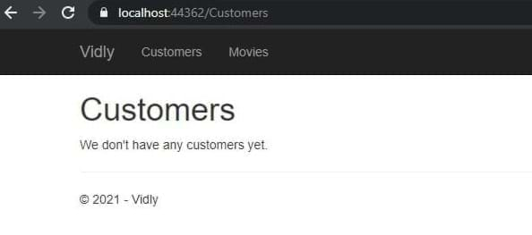
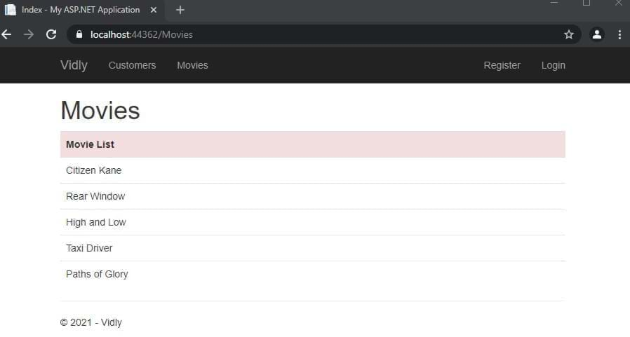
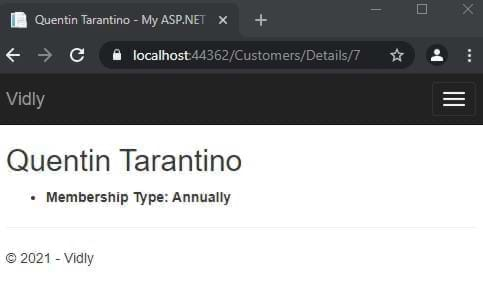
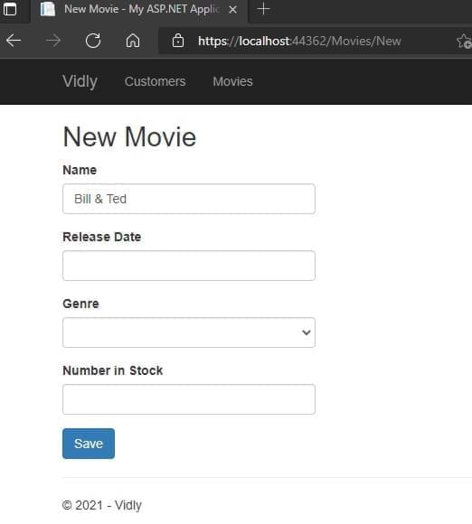
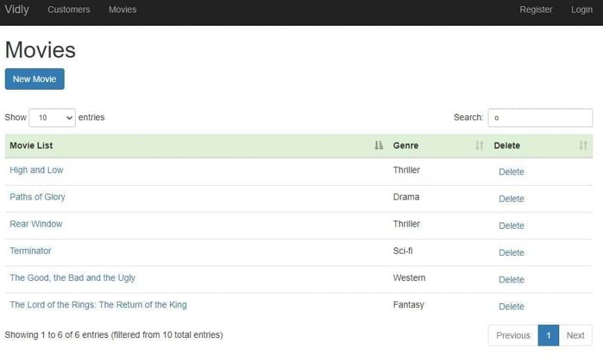

# ASP.NET MVC5 Project

This is an MVC app developed with .NET Framework 4.8 for learning purposes.

## 1 - File Structure
* App_Start: Configuration Files. Loads at application start
* Content: CSS,images, client side assets
* Controllers: Operations for handling requests
* Models: Domain classes
* Scripts: JS files
* Views: Corresponding views for controller actions
* favicon: Website icon
* Global.asax: Hooks for various events and application lifecycle
* packages.config: Nuget package dependencies list
* Startup.cs: New approach for startup configurations and logic (Net Core and beyond)
* Web.config: Configuration for application like DB connection strings,app settings for defining configuration settings

## 2 - Fundamentals

### Controller Action Structures

**Action Results**

| Type                  | Helper Method      |
| --------------------- | ------------------ |
| ViewResult            | View()             |
| PartialViewResult     | PartialView()      |
| ContentResult         | Content()          |
| RedirectResult        | Redirect()         |
| RedirectToRouteResult | RedirectToAction() |
| JsonResult            | Json()             |
| FileResult            | File()             |
| HttpNotFoundResult    | HttpNotFound()     |
| EmptyResult           | \-                 |

some examples

```csharp
public ActionResult Test()
	{
		return View(data);
		return Content("Hello World!");
		return HttpNotFound();
		return new EmptyResult();
		return RedirectToAction("Index", "Home", new {page="1",sortBy="name"});
	}		
```

### Parameter Sources

* **Embedded in the URL:** /movies/edit/1 
* In the query string: /movies/edit?id=1
* In the form data

### Routing

- **Convention based routing:** in Routeconfig.cs

- ```c#
  routes.MapRoute(
			 "MoviesByReleaseDate", //name of route
			"movies/released/{year}/{month}", //route url
			new{controller="Movies",action="ByReleaseDate"}, //default corresponding controller and actions
			new{year=@"2020|2021",month=@"\d{2}"}); //constraints for parameters
  ```

- **Attribute routing**: in Routeconfig.cs add `routes.MapMvcAttributeRoutes();` Before controller use attribute `[Route("url template")]`. *Also constraints like min, max, minlength, maxlength, int, float, guid could be used.*

- ```csharp
  [Route("movies/released/{year:regex(\\d{4}:range(1800,2021))}/{month:regex(\\d{2}:range(1,12))}")]
  public ActionResult ByReleaseDate(int year,int month)
	{
		return Content(year + "/" + month);
	}
  ```

### Passing Data to Views

* in controller

```c#
public ActionResult Test()
	{
	var movie = new Movie() { Name = "Shrek!" };
	
	ViewData["Movie"] = movie;
	ViewBag.Movie = movie;
	
	return View(movie);
}
```

* in view

```html
<h2>@Model.Name</h2> <!-- preffered way -->
<h2>@( ((Movie) ViewData["Movie"]).Name)</h2> <!-- ugly way / dont use -->
<h2>@ViewBag.Movie.Name</h2> <!-- casted at runtime / not safe -->
```

* **ViewModels**: consists multiple models. 
* in ViewModel folder

```csharp
public class RandomMovieViewModel
{
	public Movie Movie { get; set; }
	public List<Customer> Customers { get; set; }
}
```

* in controller

```cs
public class MoviesController : Controller
{
	// GET: Movies
	public ActionResult Random()
	{
		//adding data
		var movie = new Movie() { Name = "Shrek!" };
		
		var customers = new List<Customer>
		{
			new Customer {Name = "cust1"},
			new Customer {Name = "cust2"}
		};
		//filing viewmodel with data
		var viewModel = new RandomMovieViewModel()
		{
			Movie = movie, 
			Customers = customers
		};

		return View(viewModel);
	}
```

### Razor Syntax 

```cs
@*
	this is a razor comment
*@
@{
	//multiple lines
	//when razor sees html prints it and when razor sees csharp interprets it
}
@{
	var className = Model.Customers.Count > 0 ? "popular" : null;
}
 
<h2 class="@className">@Model.Movie.Name</h2>  <!-- preferred way -->
@if (Model.Customers.Count == 0)
{
	<p>No one has rented this movie before.</p>
}
 
<ul>
@foreach (var customer in Model.Customers)
   {
	   <li>@customer.Name</li>
   }
</ul>
```

### Partial Views

Create View in views as view and select partial view. Usage in another views`@Html.Partial("_PartialView", Model.Data)`

### Section Exercise







## 3 - Working with Data

* **Entity Framework:** an ORM that maps data in a relational database to our objects by using context file.

* **Linq:** Method like SQL queries.

* **Workflows:** Database First, Code First.

* **DB First:** Design database tables first, later let EF generate domain classes according to tables.

* **Code First:** Create domain classes first, later let EF generate database tables for us.

### Code-first migrations

DbSet<Domain Class> to table name in Context : DbContext class in package manager console `PM > enable-migrations` , `PM> add-migration migrationName`, `PM> update-database`

**Seeding db:** put sql commands in a migrations up() method

### Querying Objects

in controller

```csharp
private Context _context;
public CustomersController()
	  {
		  _context = new Context();
	  }
//...
public ActionResult Index()
	{
	var customers = _context.Customers.ToList();
	return View(customers);
	}
//...
public ActionResult Details(int id)
	{
	var customer = _context.Customers.Single(c => c.Id == id);
	return View(customer);
	}		
```

### Eager Loading

**load relational foreign table** : `_context.Customer.Include(c=>c.MembershipType).ToList();` 

### Section Exercise

1. 

2. 

   

3. 

   

## 4 - Building Forms

#### Markup

in View:

```csharp
@using (Html.BeginForm(actionName: "Create", controllerName: "Customers"))
{
	<div class="form-group">
		@Html.LabelFor(m=>m.Name)
		@Html.TextBoxFor(m=>m.Name,new {@class="form-control"})
	</div>
}
```

#### Labels

in Model with data annotation:

```csharp
[Display(Name="Date of Birth")]
public DateTime? Birthdate { get; set; }
```

or in view with `<label for="Birthdate">Date of Birth</label>`

#### Dropdown Lists

create viewmodel:

```cs
public class NewCustomerViewModel
{
	public IEnumerable<MembershipType> MembershipTypes { get; set; }
	public Customer Customer { get; set; }
}
```

in controller:

```cs
var membershipTypes = _context.MembershipTypes.ToList();
 
var viewModel = new NewCustomerViewModel()
{
	MembershipTypes = membershipTypes
};
```

in view:

```html
<div class="form-group">
	@Html.LabelFor(m => m.Customer.MembershipTypeId)
	@Html.DropDownListFor(m => m.Customer.MembershipTypeId, new SelectList(Model.MembershipTypes,"Id","Name"),"Select Membership Type", new { @class = "form-control" })
</div>
```

#### Model Binding

in controller:

```cs
[HttpPost]
public ActionResult Create(Customer customer)
{
	//...
	return View();
}
```

in view make sure of action name and controller name

```cs
(Html.BeginForm(actionName: "Create", controllerName: "Customers"))
//...
```

#### Saving Data

```cs
[HttpPost]
 public ActionResult Create(Customer customer)
 {
	 _context.Customers.Add(customer);
	 _context.SaveChanges();
 
	 return RedirectToAction("Index","Customers");
 }
```

#### Edit Form

fill data with corresponding item from id in controller:

```cs
	 public ActionResult Edit(int id)
	{
		var customer = _context.Customers.SingleOrDefault(c => c.Id == id);
 
		if (customer==null)
			return HttpNotFound();
 
		var viewModel = new CustomerFormViewModel()
		{
			Customer = customer,
			MembershipTypes = _context.MembershipTypes.ToList()
		};
		return View("CustomerForm", viewModel);
	}
}
```

#### Updating Data

if not exists add, if exists update. in controller map the attributes

```cs
public ActionResult Save(Customer customer)
{
	if(customer.Id==0) 
		_context.Customers.Add(customer);
	else
	{
		var customerInDb = _context.Customers.Single(c => c.Id == customer.Id);
 
 
		customerInDb.Name = customer.Name;
		customerInDb.Birthdate = customer.Birthdate;
		customerInDb.MembershipTypeId = customer.MembershipTypeId;
		customerInDb.IsSubscribedToNewsletter = customer.IsSubscribedToNewsletter;
	}
 
	_context.SaveChanges();
 
	return RedirectToAction("Index","Customers");
}
```

add the dependent id field in view as hidden:

```html
@Html.HiddenFor(m=>m.Customer.Id)
```

#### Section Exercise




## 5 - Implementing Validation

#### Adding Validation

step1: add annotations in model,
step2: add validation control in controller. when not valid return form with users data

```cs
if (!ModelState.IsValid)
{
    var viewModel = new CustomerFormViewModel
    {
    Customer = customer,
    MembershipTypes=_context.MembershipTypes.ToList()
    };
    return View("CustomerForm",viewModel);
}
```

step3: add validation message to view:

```html
@Html.ValidationMessageFor(m=>m.Customer.Name)
```

**Styling Validation Error**
access these classes and stylize:

```css
.field-validation-error{
    color:red;
}
.input-validation-error{
    border:2px red;
}
```

**Overriding Validation Message**
in model add this to required data annotation

```cs
[Required(ErrorMessage ="Please enter customer's name.")]
 [StringLength(255)]
 
 public string Name { get; set; }
```

#### Custom Validation

step1: create a class that inherits ValidationAttribute (using System.ComponentModel.DataAnnotations)

```cs
public class Min18YearsIfAMember : ValidationAttribute
   {
       protected override ValidationResult IsValid(object value, ValidationContext validationContext)
       {
           var customer = (Customer)validationContext.ObjectInstance;
 
           if (customer.MembershipTypeId==0|| customer.MembershipTypeId == 1)
           {
               return ValidationResult.Success;
           }
           if (customer.Birthdate == null)
           {
               return new ValidationResult("Birthdate is required.");
           }
 
           var age = DateTime.Today.Year - customer.Birthdate.Value.Year;
 
           return (age >= 18) 
               ? ValidationResult.Success 
               : new ValidationResult("Customer should be at least 18 years old to go on a membership.")
       }
   }
```

step2: add data annotation to model

```cs
[Display(Name = "Membership Type")]
[Min18YearsIfAMember]
public byte MembershipTypeId { get; set; }
```

step3: add message to view

```html
@Html.ValidationMessageFor(m=>m.Customer.MembershipTypeId)
```

#### Validation Summary

```html
@Html.ValidationSummary(true, "Please fix the following errors.")
```

excludePropertyErrors: true hides individual error listing
message: the displayed message to user (could be stylized)

#### Client-side validation

add this to forms on view
```cs
@section scripts{
    @Scripts.Render("~/bundles/jqueryval")
}
```

#### Anti-forgery Tokens

in views use this html helper:
```cs
@Html.AntiForgeryToken()
```

and in controller action add this data annotation:

## 6 - Web API

#### Bulding the API

in controllers create an web api an add this to global.asax.js:

```cs
GlobalConfiguration.Configure(WebApiConfig.Register);
```

in controller initialize context:

```cs
private Context _context;
 
  public CustomersController()
  {
      _context = new Context();
  }
```

create get/post/put methods like:
Get All:

```cs
//GET /api/customers
[HttpGet]
public IEnumerable<Customer> GetCustomers()
{
    return _context.Customers.ToList();
}
```

Get One:

```cs
//GET /api/customers/1
[HttpGet]
public Customer GetCustomer(int id)
{
    var customer = _context.Customers.SingleOrDefault(c => c.Id == id);
 
    if (customer == null)
        throw new HttpResponseException(HttpStatusCode.NotFound);
 
    return customer;
}
```

Create:

```cs
//POST /api/customers
[HttpPost]
public Customer CreateCustomer(Customer customer)
{
    if (!ModelState.IsValid)
        throw new HttpResponseException(HttpStatusCode.BadRequest);
 
    _context.Customers.Add(customer);
    _context.SaveChanges();
 
    return customer;
}
```

Update:

```cs
//PUT /api/customers/1
        [HttpPut]
        public void UpdateCustomer(int id,Customer customer)
        {
            if (!ModelState.IsValid)
                throw new HttpResponseException(HttpStatusCode.BadRequest);
 
            var customerInDb = _context.Customers.SingleOrDefault(c => c.Id == id);
 
            if (customerInDb == null)
                throw new HttpResponseException(HttpStatusCode.NotFound);
 
            customerInDb.Name = customer.Name;
            customerInDb.Birthdate = customer.Birthdate;
            customerInDb.IsSubscribedToNewsletter = customer.IsSubscribedToNewsletter;
            customerInDb.MembershipTypeId = customer.MembershipTypeId;
 
            _context.SaveChanges();
        }
```

Delete:

```cs
//DELETE /api/customers/1
[HttpDelete]
public void DeleteCustomer(int id)
{
    var customerInDb = _context.Customers.SingleOrDefault(c => c.Id == id);
 
    if (customerInDb == null)
        throw new 	HttpResponseException(HttpStatusCode.NotFound);
	 
    _context.Customers.Remove(customerInDb);
    _context.SaveChanges();
}
```

Test with postman

#### Data Transfer Objects

Domain objects that we remove the data we don't want to be changed or shown. Shaped for our needs. Store in Dtos folder

#### AutoMapper (4.1.1)

in App_Start create MappingProfile.cs:

```cs
public class MappingProfile : Profile
{
    public MappingProfile()
    {
        Mapper.CreateMap<Customer, CustomerDto>();
        Mapper.CreateMap<CustomerDto, Customer>();
    }
}
```

add Mapper to Global.asax.cs

```cs
protected void Application_Start()
{
    Mapper.Initialize(c=>c.AddProfile<MappingProfile>());
    //..
}
```

update controller actions:

```cs
//GET /api/customers
[HttpGet]
public IEnumerable<CustomerDto> GetCustomers()
{
    return _context.Customers.ToList().Select(Mapper.Map<Customer, CustomerDto>);
}
```

```cs
//GET /api/customers/1
[HttpGet]
public CustomerDto GetCustomer(int id)
{
    var customer = _context.Customers.SingleOrDefault(c => c.Id == id);
 
    if (customer == null)
        throw new HttpResponseException(HttpStatusCode.NotFound);
 
    return Mapper.Map<Customer, CustomerDto>(customer);
}
```

```cs
//POST /api/customers
[HttpPost]
public CustomerDto CreateCustomer(CustomerDto customerDto)
{
    if (!ModelState.IsValid)
        throw new HttpResponseException(HttpStatusCode.BadRequest);
 
    var customer = Mapper.Map<CustomerDto, Customer>(customerDto);
    _context.Customers.Add(customer);
    _context.SaveChanges();
 
    customerDto.Id = customer.Id;
 
    return customerDto;
}
```

```cs
//PUT /api/customers/1
[HttpPut]
public void UpdateCustomer(int id, CustomerDto customerDto)
{
    if (!ModelState.IsValid)
        throw new HttpResponseException(HttpStatusCode.BadRequest);
 
    var customerInDb = _context.Customers.SingleOrDefault(c => c.Id == id);
 
    if (customerInDb == null)
        throw new HttpResponseException(HttpStatusCode.NotFound);
 
    Mapper.Map(customerDto, customerInDb);
 
 
    _context.SaveChanges();
}
```

#### Camel Notation

in App_Start WebApiConfig.cs add in register

```cs
var settings = config.Formatters.JsonFormatter.SerializerSettings;
         settings.ContractResolver = new CamelCasePropertyNamesContractResolver();
         settings.Formatting = Formatting.Indented;
```

#### IHttpActionResult

Correct Http results for our actions:

```cs
//GET /api/customers/1
[HttpGet]
public IHttpActionResult GetCustomer(int id)
{
    var customer = _context.Customers.SingleOrDefault(c => c.Id == id);
 
    if (customer == null)
        return NotFound();
 
    return Ok(Mapper.Map<Customer, CustomerDto>(customer));
}
```

```cs
//POST /api/customers
[HttpPost]
public IHttpActionResult CreateCustomer(CustomerDto customerDto)
{
    if (!ModelState.IsValid)
        return BadRequest();
 
    var customer = Mapper.Map<CustomerDto, Customer>(customerDto);
    _context.Customers.Add(customer);
    _context.SaveChanges();
 
    customerDto.Id = customer.Id;
 
    return Created(new Uri(Request.RequestUri+"/"+customer.Id),customerDto);
}
```

#### Section Exercise

Postman:
GET: https://localhost:44362/api/movies 200 OK

```json
[
    {
        "id": 1,
        "name": "Citizen Kane",
        "genreId": 3,
        "dateAdded": "1900-01-01T00:00:00",
        "releaseDate": "1941-01-01T00:00:00",
        "numberInStock": 4
    },
    {
        "id": 3,
        "name": "Rear Window",
        "genreId": 10,
        "dateAdded": "1900-01-01T00:00:00",
        "releaseDate": "1954-01-01T00:00:00",
        "numberInStock": 3
    },
//.......
]
```

GET: https://localhost:44362/api/movies/7 200 OK

```json
{
    "id": 7,
    "name": "The Good, the Bad and the Ugly",
    "genreId": 6,
    "dateAdded": "1900-01-01T00:00:00",
    "releaseDate": "1966-01-01T00:00:00",
    "numberInStock": 1
}
```

POST: https://localhost:44362/api/movies 201 Created

```json
{
  "name": "Life Is Beautiful",
  "genreId": 3,
  "dateAdded": "1900-01-01T00:00:00",
  "releaseDate": "1997-01-01T00:00:00",
  "numberInStock": 1
}
```

PUT: https://localhost:44362/api/movies/11 204 No Content

```json
{
  "name": "Life Is Beautiful",
  "genreId": 3,
  "dateAdded": "1900-01-01T00:00:00",
  "releaseDate": "1997-01-01T00:00:00",
  "numberInStock": 5
}
```

DELETE: https://localhost:44362/api/movies/12 204 No Content

## 7 - Client-side Development

#### jQuery, Ajax

in view add classes, data and id to items. and at the end script:

```html
<table id="customers" <--- 
       class="table table-borderless">
           <tr class="danger">
               <th>Customers</th>
....
....
<td>
    <button data-customer-id="@item.Id" <---
            class="btn-link js-delete" <---
            >
        Delete
    </button>
</td>
.....
@section scripts{
    <script>
        $(document).ready(function() {
            $("#customers .js-delete").on("click", function () {
                var button = $(this);
                if (confirm("sure to delete?")) {
                    $.ajax({
                        url: "/api/customers/" + button.attr("data-customer-id"),
                        method: "DELETE",
                        success:function() {
                            alert("success");
                            button.parents("tr").remove();
                        }
                    });
                }
            });
        });
    </script>
}     
```

#### Bootbox

add in BundleConfig.cs:

```cs
bundles.Add(new ScriptBundle("~/bundles/bootstrap").Include(
          "~/Scripts/bootstrap.js",
          "~/Scripts/bootbox.js", //<--- here
          "~/Scripts/respond.js"
          ));
```

implement in view:

```html
@section scripts{
<script>
    $(document).ready(function () {
        $("#customers .js-delete").on("click", function () {
            var button = $(this);
            bootbox.confirm("sure to delete?", function (result) {
                if (result) {
                    $.ajax({
                        url: "/api/customers/" + button.attr("data-customer-id"),
                        method: "DELETE",
                        success: function () {
                            alert("success");
                            button.parents("tr").remove();
                        }
                    });
                }
            });
        });
    });
</script>
}
```

#### DataTables

add to bundles:
(and we merged third party bundles to lib. in _Layout.cshtml -> `@Scripts.Render("~/bundles/lib")`)

```cs
         bundles.Add(new ScriptBundle("~/bundles/lib").Include(
                        "~/Scripts/jquery-{version}.js",
                        "~/Scripts/bootstrap.js",
                        "~/Scripts/bootbox.js",
                        "~/Scripts/respond.js",
                        "~/Scripts/DataTables/jquery.dataTables.js", //<--
                        "~/Scripts/DataTables/dataTables.bootstrap.js" //<--
                        ));
```

```cs
bundles.Add(new StyleBundle("~/Content/css").Include(
               "~/Content/bootstrap.css",
               "~/content/datatables/css/dataTables.bootstrap.css", //<-- style
               "~/Content/site.css"));
```

in view tables should have id and thead, tbody tags. lastly in script section when document ready:

```js
$(document).ready(function () {
            $("#customers").DataTable();
    //...
}
```

#### DataTables with Ajax Source (API)

in jquery datatable call:

```js
$(document).ready(function () {
        $("#customers").DataTable({
            ajax: {
                url: "/api/customers",
                dataSrc: ""
            },
            columns: [
                {
                    data: "name",
                    render: function (data, type, customer) {
                        return "<a href='/customers/edit/'" + customer.id + "'>" + customer.name;
                    }
                },
                {
                    data: "membershipType.name"
                },
                {
                    data: "id",
                    render: function (data) {
                        return "<button class='btn-link js-delete' data-customer-id=" + data + ">Delete</button>";
                    }
                }
            ]
        });
```

#### Hierarchical Data

step 1: create dto, 
step 2: add dto to parent dto 
step 3.map in mapping profile
step 4: add to controller (._appDbContext.Customers.Include(c=>c.MembershipType).ToList()..) 
step 5: add to view column like:


```js
{
    data: "membershipType.name"
},
```

#### Removing records bug

assign table to variable and use it in remove method:

```html
    <script>
        $(document).ready(function () {
            var table //<--
            = $("#customers").DataTable({
                ajax: {
                    url: "/api/customers",
                    dataSrc: ""
                },
                columns: [
                    {
                        data: "name",
                        render: function (data, type, customer) {
                            return "<a href='/customers/edit/'" + customer.id + "'>" + customer.name;
                        }
                    },
                    {
                        data: "membershipType.name"
                    },
                    {
                        data: "id",
                        render: function (data) {
                            return "<button class='btn-link js-delete' data-customer-id=" + data + ">Delete</button>";
                        }
                    }
                ]
            });


            $("#customers").on("click", ".js-delete", function () {
                var button = $(this);
                bootbox.confirm("Are you sure you want to delete this customer?", function (result) {
                    if (result) {
                        $.ajax({
                            url: "/api/customers/" + button.attr("data-customer-id"),
                            method: "DELETE",
                            success: function () {
                                ///<--- here
                                table.row(button.parents("tr"))
                                    .remove().draw();
                            }
                        });
                    }
                });
            });
        });
    </script>
```

#### Section Exercise



## 8 - Authentication and Authorization

all the logic comes built in (see commit for files and details)

#### Restricting Access

add **[Authorize]** attribute to controller actions or on top of the controller to restrict all actions

**FilterConfig.cs:**

```cs
filters.Add(new AuthorizeAttribute());
```

this disables all controllers for unauthorized users
but you can add **[AllowAnonymous]** to controllers or actions to enable access

**Seeding the database**:
To keep the consistency of the project on different work scenarios add them to a migration

#### Working with Roles

create separate views for guests and authorized users

in controller:

```cs
public ViewResult Index(int? pageIndex, string sortBy)
 {
     if (User.IsInRole(RoleName.CanManageMovies))
         return View("List");
     return View("ReadOnlyList");   
}
```

to disable other actions access add this attribute:
`[Authorize(Roles = RoleName.CanManageMovies)]`

create a model for keeping roles RoleName.cs:

```cs
public const string CanManageMovies = "CanManageMovies";
```

#### Adding Profile data

to add custom fields to the user: add the prop to both application user class and viewmodel of the view. also add new prop to register actions assignment section

#### OAuth (Open Authorization) - Social Logins

enable ssl in properties, add filter

```cs
filters.Add(new RequireHttpsAttribute());
```

get AppId and AppSecret from facebook, google ... 
insert in startup.auth.cs

```cs
app.UseFacebookAuthentication(
   appId: "id",
   appSecret: "secret");
```

add any custom props to external login form and viewmodel. initialize in external login controller

#### Section Exercise


## 9 - Performance Optimization

#### Glimpse

in nuget install Glimpse.MVC5 and Glimpse.EF6 
go to /glimse.axd and enable

#### Caching

**Disable caching:**
 `[OutputCache(Duration = 0, VaryByParam = "*", NoStore = true)]` 

**Enable caching:**

`[OutputCache(Duration=50,Location=OutputCacheLocation.Server,VaryByParam="genre")]`

#### Data Cache

in controller action

```cs
if (MemoryCache.Default["Genres"] == null)
        {
            MemoryCache.Default["Genres"] = _appDbContext.Genres.ToList();
        }
 
        var genres = MemoryCache.Default["Genres"] as IEnumerable<Genre>;
```

#### Disabling Session

in Web.config in system.web
 <sessionState mode="Off"></sessionState>

## 10 - Building a Feature End to end

we gonna add a renting feature to our app
Create Dto: NewRentalDto:

```cs
public class NewRentalDto
{
    public int CustomerId { get; set; }
    public List<int> MovieIds { get; set; }
}
```

Create Model: Rental, add to context and run a migration

```cs
public class Rental
{
    public int Id { get; set; }
    [Required]
    public Customer Customer { get; set; }
    [Required]
    public Movie Movie { get; set; }
    public DateTime DateRented { get; set; }
    public DateTime? DateReturned { get; set; }
}
```

more details on commits. (used typeahead, bloodhound for autocomplete)

## 11 - Publishing & Deployment

right click and publish

#### Deploying DB

`PM> update-database -script -SourceMigration:SeedUsers`

target mig to last. you got sql query of your db now

#### Build Configurations

1. click solution configurations > configurationManager create a new config
2. right click to web.config and add config transform
3. now configure new config
4. when publishing you could use these configuration to use on the published project
   note: configs overrides web.config for different scenarios with xdt:...
   you could preview by right clicking config and selecting preview transform

#### Application Settings

**in Web.config**
`<appSettings key="value"></appSettings>`
**or externally create another config file**
 `<appSettings configSource="AppSettings.config"></appSettings>`
**use in code like:**
`ConfigurationManager.AppSettings["Key"]`
**note:** appsettings always returns strings. you need to convert it for your needs manually

#### Custom Error Pages

###### Exception errors
in Web.config add to `<system.web>`

```
  <customErrors mode="On"></customErrors>
```

**On:** enable everywhere
**Remote:** disable on localhost

Customize in Views>Shared Error.cshtml

##### Not Found Error (404)

in Web.config add to `<system.web>` > `<customErrors>`

```xml
  <system.web>
    <customErrors mode="On">
      <error statusCode="404" redirect="~/404.html"/>
    </customErrors>
      <!--.....-->
</system.web>
```

##### IIS Errors

n Web.config add to `<system.webServer>` 

```xml
    <httpErrors errorMode="Custom">
      <remove statusCode="404"/>
      <error statusCode="404" path="404.html" responseMode="File"/>
    </httpErrors>
```

**Custom:** enable everywhere
**DetailedLocalOnly:** disable on localhost

#### Elmah

Nuget> Elmah

exception logger. access by **/elmah.axd**

- by default it saves logs to memory but with a small configuration we could have these exceptions on all kind of databases

- for accessing remotely add this to elmah

  ```xml
        <authorization>
          <allow roles="admin,user2,user3,..." />
          <deny users="*" />  
        </authorization>
  ```

**THANKS!!!**
